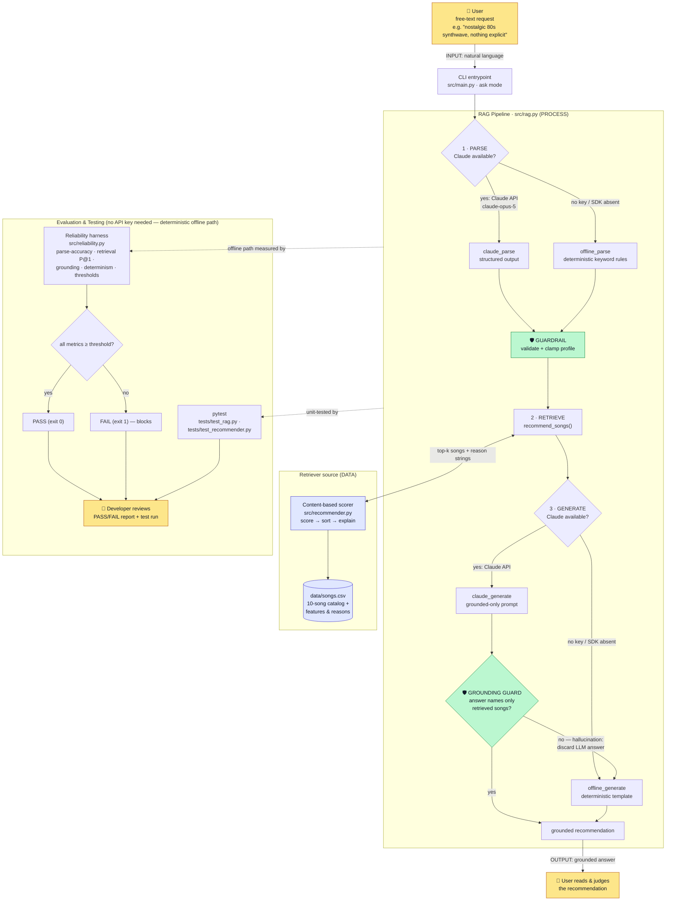

# VibeMatch — System Diagram

A view of how the project is organized: the main components, how data flows
(input → process → output), and where humans and automated testing check the AI
results. The source below is Mermaid, so the structure is readable directly from
the file (and renders automatically on GitHub).

## How to read it

- **Input → Process → Output.** A natural-language request enters through the
  CLI, flows through the three RAG stages (**parse → retrieve → generate**), and
  leaves as a grounded recommendation the user reads.
- **Main components.**
  - **Retriever** — `src/recommender.py` scoring the `data/songs.csv` catalog and
    returning top‑k songs *with their reason strings*.
  - **AI parse/generate (the "agent" steps)** — `src/rag.py` calls Claude
    (`claude-opus-5`) when a key is present, or a deterministic offline
    implementation otherwise, so the system is reproducible with no key.
  - **Evaluator / tester** — `src/reliability.py` (metrics + a pass/fail gate)
    and `pytest`.
- **Where AI results are checked (🛡️ / 👤).**
  - **Grounding guard** — automatically verifies the generated answer names only
    songs that were actually retrieved; a hallucinated answer is discarded and
    the deterministic generator is used instead.
  - **Profile guardrail** — validates/clamps the parsed profile before scoring.
  - **Reliability gate + pytest** — measure the pipeline and block on regression.
  - **Humans** — the user judges the final recommendation; the developer reviews
    the PASS/FAIL report and test results.
